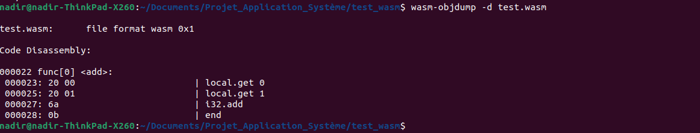
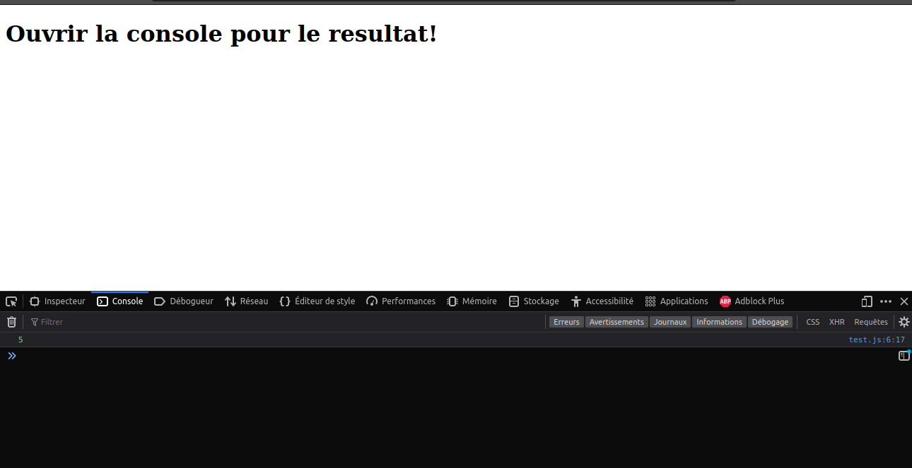
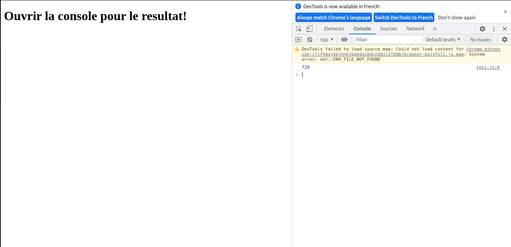

# WebAssembly - Généralité

## Introduction
Dans le cadre du module Application Système du semestre 5 à l'ENSTA Bretagne, plusieurs sujets ont été proposé. Un sujet m'a tout de suite intéressé : Le WebAssembly. J'ai pris ce sujet car c'était un sujet orienté recherche/découverte et la deuxième raison est que je ne connaissais pas du tout le WebAssembly et ma curiosité a pris le dessus. 

Dans ce rapport, je vais vous présenter le WebAssembly. En première partie, je vais présenter les généralité, puis en seconde partie, la proximité du WebAssembly avec les langages de haut niveau puis en troisième partie, vous présenter mon simulateur de machine à état finis et vous expliquer comment il fonctionne et pour finir, une conclusion.

## Historique 
En 1995, Javascript était créé en l’espace de 10 jours par Brendan Eich. Et à ce moment précis, Javascript c’était pas du tout désigné pour être rapide. Sortie de la validation de formulaires c’est l’enfer comme c’est lent. Au fur et à mesure du temps ça s’arrangeait, mais à cette époque, Javascript jouait avec son caca côté performance.

En 2008, Google est sorti de nulle part et a posé sur la table son nouveau navigateur : Google Chrome. À l’intérieur de Chrome se trouvait un moteur Javascript appelé V8. Et la révolution de V8 c’était la compilation Just in Time (JIT) du Javascript. Ce changement de code interprété à la compilation JIT accélérait monstrueusement les performances de Javascript, et donc des navigateurs de façon générale. Cette vitesse allait permettre la naissance de technologie comme NodeJS ou Électron et l’explosion de popularité de Javascript.

En 2015, WebAssembly est pour la première fois annoncé avec une petite démo d’un jeu qui tourne sous Unity. Le jeu tourne directement dans le navigateur.

En 2019, la W3C faisait de WebAssembly une nouvelle norme du web. Comme l’a été le moteur V8 à son époque, WebAssembly s’annonce comme la nouvelle révolution coté performance. WebAssembly est donc déjà là, et son top départ a été fulgurant.

## Qu'est ce que le WebAssembly ?
Le WebAssembly(abrégé WASM) est un nouveau type de code pouvant s'executer sur les navigateur web et peut donner des nouvelles fonctionnalités.
Ce type est principalement développé par le [W3C Community Group](https://www.w3.org/community/webassembly/). Le WebAssembly est principalement intégré dans les navigateur connu d'aujourd'hui : Firefox, Chrome, Opera, Safari.


## A quoi cela sert t-il ?

Le WebAssembly n'est généralement pas utilisé comme langage. Il est principalement utilisé comme cible de compilation à partir des langages de haut niveau choisi par les développeurs. 

Ainsi, les développeurs peuvent développer des programme dans ces langages, les compiler en wasm et les executer sur le navigateur Web.

Cependant, il faut noter que le WebAssembly possède une representation textuelle. Sa représentation textuelle est le WAT(WebAssembly Text).

## Sa représentation Textuelle : le WAT

Pour que le WebAssembly soit lu et edité par les hommes, le WAT, le format textuelle a été développé. 

Nous allons voir sa s-expression et la syntaxe du langage: 

La principale unité de code dans le WebAssembly est un module.

```
(module (memory 1) (func))
```
On peut illustrer cela comme un arbre avec des noeuds. Chaque expression entre parenthèse représente un noeud. Dans ce cas, le noeud est le module et les noeuds enfants sont memory avec 1 comme attribut et un autre noeud : func.

Nous pouvons commencer un programme WebAssembly dans le plus simple des cas : 
```
(module)
```

Ensuite, nous pouvons complexifier le module en ajoutant un noeud func : 
```
( func <signature> <locals> <body> )
```
- La signature prend les paramètres de la fonction ainsi que ses types.

- La partie locals prends les variables et ses types.

- La partie body est une suite linéaire d'instruction de bas niveau.

Signature et paramètres : 

| Paramètre | types         |
|-----------|----------------
| i32       | 32bit integer |
| i64       | 64bit integer |
| f32       | 32bit float   |
| f64       | 64bit float   |

Il existe plusieurs commandes pour récupérer des valeurs des paramètres. En effet, les commandes local.get/local.set font référence à l'élément à obtenir/à définir par son index numérique : les paramètres sont mentionnés en premier, dans l'ordre de leur déclaration, suivis des locaux dans l'ordre de leur déclaration.

Voici un exemple : 
```
(func (param i32) (param f32) (local f64)
  local.get 0
  local.get 1
  local.get 2)
```
Le principe est simple : ici, on veut récupérer la valeur du paramètre i32, la valeur du paramètre f32 et la valeur du paramètre f64.

## Son format binaire

A la compilation, nous pouvons lire le fichier wasm et on pourra distinguer des données binaire:

 

Les données sont pricipalement de l'héxadécimale. Cependant, il est impossible pour l'homme de debugguer ou modifier le programme à partir de ce binaire. Il faut aller dans le format textuelle pour pouvoir faire des modifications.

## Exemple de programmes WebAssembly text 

Pour montrer comment le langage WebAssembly Text fonctionne, j'ai fait 2 programmes : un simple, et un complexe. 
Le programme simple est une simple addition entre 2 entiers. Et le programme plus complexe est un programme qui fait un factorielle d'un nombre. Dans cette partie, nous allons également voir comment executer un programme WASM et le Compiler.

Programme 1 : Addition 
```
(module
    (func $add (param i32) (param $p1 i32) (result i32)
    local.get 0
    local.get $p1
    i32.add
    )
    (export "add" (func $add))
)
``` 
Dans ce programme, on récupère le premier paramètre i32 et le paramètre $p1 grâce à l'instruction local.get. Ensuite, on ajoute ces deux paramètre récupérer grâce à l'instruction de bas niveau : i32.add .

Enfin, pour pouvoir uiliser la fonction dans un autre programme, on exporte la fonction grâce à l'instruction export à la fin du programme. 

Après avoir fait ce programme, il faut faire un programme en Javascript. Ce programme Javascript va indiquer au navigateur Web d'éxecuter le programme .WASM en instanciant un module WebAssembly.

```Javascript
fetch("test.wasm")
    .then(response => response.arrayBuffer())
    .then(bytes => WebAssembly.instantiate(bytes))
    .then(response => {
        let result = response.instance.exports.add(3,2);
        console.log(result);
    });
``` 
Dans ce programme Javascript, on utilise la fonction Fetch.
On va récuperer le programme .wasm généré grâce à la fonction fetch et ainsi pouvoir l'executer grâce à l'instruction response(réponse de la requète HTTP).

On fait appel à la fonction codé en WAT avec la fonction exports qui permet d'appelé les fonction exporté. Ici, on veut addition 3+2. Dans la console du navigateur, nous devrons visualiser 5.



Exemple 2(plus complexe) : Programmation de factorielle en WebAssembly Text : 

```
(func $fac_loop 
      (param $n i32)
      (result i32)
      (local $i i32)
      (local $fac i32)
  i32.const 2
  local.get $n
  i32.ge_s
  if (result i32)
    local.get $n
    return
  else
    i32.const 1
    local.set $fac
    i32.const 2
    local.set $i

    loop
      local.get $i
      local.get $fac
      i32.mul
      local.set $fac

      local.get $i
      i32.const 1
      i32.add
      local.set $i

      local.get $n
      local.get $i
      i32.ge_s
      br_if 0
    end

    local.get $fac
    return
  end)
  (export "fac_loop" (func $fac_loop))
```

Dans ce programme, la fonction mathématique factorielle a été programmé.

On compile le programme la commande wat2wasm et on effectue le même processus que pour l'addition.

On fait un factorielle de 6  : 
```Javascript
fetch("test.wasm")
    .then(response => response.arrayBuffer())
    .then(bytes => WebAssembly.instantiate(bytes))
    .then(response => {
        let result = response.instance.exports.fac_loop(6);
        console.log(result);
    });
```
On voit bien que le résultat est bon : 720




Dans cette partie, nous avons vu ce qu'est le WebAssembly et à quoi ça sert en général. Nous avons également vu sa représentation textuelle. 

Dans la prochaine partie, nous allons la relation du WebAssembly avec les langages de haut niveau.
