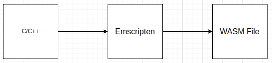
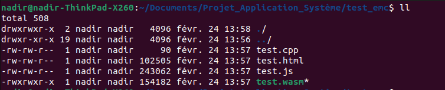
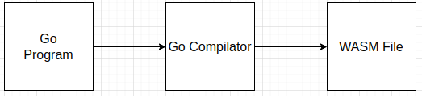
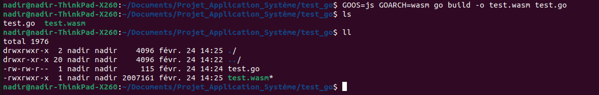

# WebAssembly et Langage de Hauts Niveaux

Dans cette partie, nous allons voir que on peut aussi obtenir du WebAssembly à partir de langage de haut niveau. En effet, les compilateurs de langages de haut niveau peuvent génerer du wasm à partir des programmes codés en langage de haut niveau.

## Quels sont les langages utilisés ? 

On peut générer du wasm à partir des langages suivants : 
  - C/C++
  - GO
  - Python
  - Rust
  - Ruby
  - AssemblyScript
  
Ce sont les principaux langages utilisés pour programmer du WebAssembly et ainsi, faire des applications sur Navigateur.

Mais on peut se poser la question de l'utilisation de ces langages pour utiliser WebAssembly. En effet, nous avons dans la première partie "WebAssembly et Géneralité" que le WebAssembly dispose d'une représentation textuelle et qu'on peut programmer avec cette représentation textuelle.

## Pourquoi on utilise majoritairement les langages de haut niveau et non la representation textuelle du WebAssembly pour coder vers wasm ?

Nous avons vu que le WebAssembly est de manière génerale, utilisé avec des langages de haut niveaux. 
Mais, le WebAssembly possède également une représentation textuelle avec lequel on peut programmer du WebAssembly. Alors, pourquoi les développeurs n'utilise pas tout simplement la représentation textuelle pour programmer des applications/jeux sur navigateurs ?

Il faut savoir qu'il y a une raison simple à cela et que nous avons vu une de ces raisons dans la partie Généralité lorsque 2 exemples de programmes en WebAssembly Text a été présenté. 

En effet, pour programmer une simple fonction mathématique, le factorielle, il nous a fallu près de 40 lignes de code pour le faire. Aussi, pour faire une simple fonction addition, il nous a fallu 7 lignes de code. 

En langage de haut niveau, on peut programmer un factorielle en 4/5 lignes de code et une addition une 2/3 lignes à peine. 

Donc, ici, la première raison est que en langage de haut niveau, la programmation est beaucoup plus efficace. En effet, on WebAssembly Text, on reste très limité en possibilité notamment à cause du nombre de ligne de code requis pour programmer des choses beaucoup plus complexe. 

De plus, lorsque le développeur voudra programmer des choses beaucoup plus complexe, comme par exemple, une application ou un jeu, cela peut prendre 200/300 lignes de code voire plus. Et rappelons que que le format WebAssembly Text possède des formats de variables en 32 et 64 bit soit en float, soit en integer. Donc si il y a un bug quelconque, ou si le developpeur a fait une erreur de programmation et que il veut debugguer, la tâche sera grandement difficile à cause du nombre important du ligne de code à examiner et de la complexité du format Textuelle WebAssembly.

Enfin, il est bon de rappeler que le WebAssembly a été conçu dans un premier temps comme cible de compilation à partir de langage de haut niveau pour programmer sur Web.

Donc on peut en conclure, que, à l'heure actuelle, les langages de hauts niveaux restent le meilleur moyen et le plus adapté pour programmer avec WebAssembly.

Nous avons vu dans cette partie que les langages de haut niveaux restent le meilleur moyen et le plus adapté pour programmer avec WebAssembly. Mais une question se pose, quels sont les intermédiaire entre les langages de haut niveaux et le format WebAssembly qui nous permet d'executer notre programme sur Navigateur Web.

## Quels sont les intermédiaires entre le WebAssembly et les langages de haut niveaux?
  
Nous avons vu que nous pouvons générer du WebAssembly à partir de langages de hauts niveaux. Mais comment cela fonctionne t-il ?

Les langages de haut niveaux possède des compilateur qui peuvent prendre comme cible le WebAssembly. En effet, lorsqu'un utilisateur fait un programme en C++, Python ou en GO, l'utilisateur peut compiler avec des compilateur fait pour compiler vers WASM. Nous allons voir les différents compilateurs qui existe pour compiler vers WASM. Ici, nous en présenterons pour 3 langages : C/C++, Python et le langage GO.

- C/C++:

Le compilateur utilisé pour générer du wasm à partir du C/C+ est emscripten.


Emscripten est un compilateur LLVM(Low Level Virtual Machine) qui permet de compiler un programme C/C++ vers du WebAssembly. Ainsi, en sortie de compilation, un fichier .wasm est obtenu et prêt à être éxecuté. Voici un aperçu de la chaîne de fonctionnement global pour compiler un programme C/C++ vers du WASM.

 

Pour ce cas, on code un programme en C++ en faisant un simple Hello World : 
```C++
#include <iostream>

int main() {
	std::cout << "Hello World" << std::endl;
	return 0;
}
```

Après avoir fait ce programme, on peut compiler avec emscripten en faisant : 
```bash
emcc test.cpp -s WASM=1 -o test.html
```
Emscripten va générer une page html ainsi qu'un fichier wasm : 


Ainsi, on obtient un fichier wasm prêt à l'emploi.

- Go : 

Le compilateur qui permet de générer du wasm à partir du langage GO est le compilateur GO lui même. En effet, les développeur du langage Go ont intégré dans le compilateur officiel de GO une nouvelle cible de compilation : le wasm.



Pour ce cas, on code un programme GO qui fait un simple affichage dans la console du navigateur un texte : "Test" et nommera ce programme test.go: 
```GO
package main

import (
	"fmt"
)

func main() {
	quit := make(chan struct{}, 0)

	fmt.Println("Test")
	
	<-quit
}
```
Pour compiler ce programme vers du WASM, il faut entrer cette commande suivante : 
```bash
GOOS=js GOARCH=wasm go build -o test.wasm test.go
```
Ainsi, nous obtenons un fichier wasm prêt à l'emploi : 



Pour les autres langages, le principe de fonctionnement reste globalement le même.

Dans cette partie, nous avons vu que avec les langages de haut niveaux comme le C/C++, le GO, Python, Rust, etc.. nous pouvons générer du WebAssembly. Nous avons également démontrer l'avantage de programmer avec les langages de haut niveau par rapport au format Textuelle du WebAssembly. Nous avons également vu les chaîne de fonctionnement qui permettent de compiler des programmes codés avec des langages de hauts niveaux vers du wasm.

Dans la prochaine partie, nous allons voir le fonctionnement d'un simulateur de FSM que j'ai moi-même programmé.