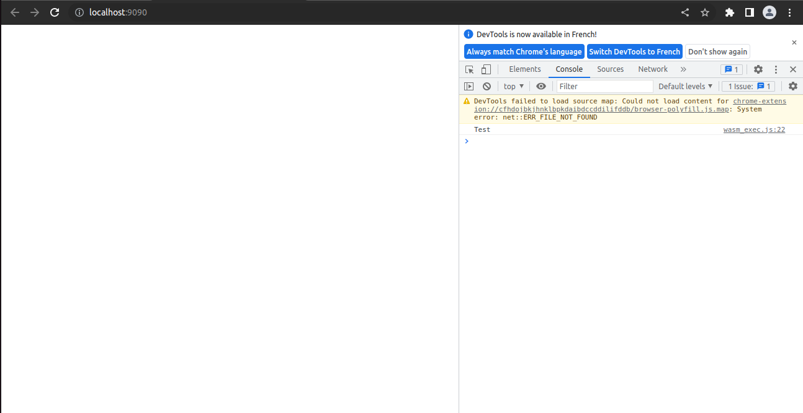

# WebAssembly et Langage de Hauts Niveaux

Dans cette partie, nous allons voir qu'on peut aussi obtenir du WebAssembly à partir de langages de haut niveau. En effet, les compilateurs de langages de haut niveau peuvent générer du wasm à partir des programmes codés en langage de haut niveau.

## Quels sont les langages utilisés ? 

On peut générer du wasm à partir des langages suivants : 
  - C/C++
  - Go
  - Python
  - Rust
  - Ruby
  - AssemblyScript
  
Ce sont les principaux langages utilisés pour programmer du WebAssembly et ainsi, faire des applications sur navigateur.

Mais on peut se poser la question de l'utilisation de ces langages pour utiliser WebAssembly. En effet, nous avons vu dans la première partie "WebAssembly et Géneralité" que le WebAssembly dispose d'une représentation textuelle et qu'on peut programmer avec cette représentation textuelle.

## Pourquoi on utilise majoritairement les langages de haut niveau et non la représentation textuelle du WebAssembly pour coder vers wasm ?

Nous avons vu que le WebAssembly est de manière générale, utilisé avec des langages de haut niveau. 
Mais, le WebAssembly possède également une représentation textuelle avec lequel on peut programmer du WebAssembly. Alors, pourquoi les développeurs n'utilisent pas tout simplement la représentation textuelle pour programmer des applications/jeux sur navigateurs ?

Il faut savoir qu'il y a une raison simple à cela et que nous avons vu une de ces raisons dans la partie Généralité lorsque 2 exemples de programmes en WebAssembly Text a été présentés. 

En effet, pour programmer une simple fonction mathématique, le factorielle, il nous a fallu près de 40 lignes de code pour le faire. Aussi, pour faire une simple fonction addition, il nous a fallu 7 lignes de code. 

En langage de haut niveau, on peut programmer un factorielle en 4/5 lignes de code et une addition en 2/3 lignes à peine. 

Donc, ici, la première raison est qu'en langage de haut niveau, la programmation est beaucoup plus efficace. En effet, en WebAssembly Text, on reste très limité en possibilité notamment  à cause du nombre de lignes de code requis pour programmer des choses beaucoup plus complexes.

De plus, lorsque le développeur voudra programmer des choses beaucoup plus complexes, comme par exemple, une application ou un jeu, cela peut prendre énormément de lignes de code en WebAssembly Text. Et rappelons que que le format WebAssembly Text possède des formats de variables en 32 et 64 bit soit en float, soit en integer. Donc si il y a un bug quelconque, ou si le developpeur a fait une erreur de programmation et qu'il veut debugguer, la tâche sera grandement difficile à cause du nombre important du ligne de code à examiner et de la complexité du format Textuelle WebAssembly.

Enfin, il est bon de rappeler que le WebAssembly a été conçu dans un premier temps comme cible de compilation à partir de langage de haut niveau pour programmer sur Web.

Donc on peut en conclure, que, à l'heure actuelle, les langages de haut niveau restent le meilleur moyen et le plus adapté pour programmer avec WebAssembly.

Nous avons vu dans cette partie que les langages de haut niveau restent le meilleur moyen et le plus adapté pour programmer avec WebAssembly. Mais une question se pose, quels sont les intermédiaires entre les langages de haut niveau et le format WebAssembly qui nous permet d'exécuter notre programme sur Navigateur Web.

## Quels sont les intermédiaires entre le WebAssembly et les langages de haut niveau?
  
Nous avons vu que nous pouvons générer du WebAssembly à partir de langages de haut niveau. Mais comment cela fonctionne t-il ?

Les langages de haut niveau possèdent des compilateurs qui peuvent prendre comme cible le Web Assembly. En effet, lorsqu'un utilisateur fait un programme en C++, Python ou en Go, l'utilisateur peut compiler avec des compilateurs fait pour compiler vers WASM. Nous allons voir les différents compilateurs qui existent pour ces langages pour compiler vers WASM. Ici, nous présenterons le cas pour 2 langages : C/C++ et Go.

- C/C++:

Le compilateur utilisé pour générer du wasm à partir du C/C+ est emscripten.


Emscripten est un compilateur LLVM(Low Level Virtual Machine) qui permet de compiler un programme C/C++ vers du WebAssembly. Ainsi, en sortie de compilation, un fichier .wasm est obtenu et prêt à être éxecuté. Voici un aperçu de la chaîne de fonctionnement global pour compiler un programme C/C++ vers du WASM.

 

Par exemple, on code un programme en C++ en faisant un simple Hello World : 
```C++
#include <iostream>

int main() {
	std::cout << "Hello World" << std::endl;
	return 0;
}
```

Après avoir fait ce programme, on peut compiler avec emscripten en faisant : 
```bash
emcc test.cpp -s WASM=1 -o test.html
```
Emscripten va générer une page html ainsi qu'un fichier wasm : 


Ainsi, après avoir fait un script Javascript ainsi qu'une page html pour pouvoir exécuter le fichier wasm, on obtient un fichier wasm prêt à l'emploi.

- Go : 

Le compilateur qui permet de générer du wasm à partir du langage GO est le compilateur GO lui même. En effet, les développeurs du langage Go ont intégré dans le compilateur officiel de GO la cible de compilation vers wasm. La méthodologie permettant de compiler un programme Go en wasm est la suivante:


Par exemple, on code un programme Go qui affiche dans la console du navigateur web le mot : "Test". On nommera ce programme test.go: 
```GO
package main

import (
	"fmt"
)

func main() {
	quit := make(chan struct{}, 0)

	fmt.Println("Test")
	
	<-quit
}
```
Pour compiler ce programme vers du WASM, il faut entrer les commandes suivantes : 
```bash
cp -f "$$(go env GOROOT)/misc/wasm/wasm_exec.js" <vers_dossier_ou_se_situe_votre_fichier_wasm>
GOOS=js GOARCH=wasm go build -o test.wasm test.go
```
La première commande est nécessaire car WebAssembly existe avec le Javascript. Ainsi le fichier javascript garantissant le fonctionnement de WebAssembly est présent dans votre environnement Go. Il suffit juste de l'importer vers votre dossier où se trouve votre fichier wasm.

Ainsi, nous obtenons un fichier wasm prêt à l'emploi : 


Ensuite il faut créer une page html :   
```html
<html>  
    <head>
        <meta charset="utf-8"/>
        <script src="wasm_exec.js"></script>
        <script>
            const go = new Go();
            WebAssembly.instantiateStreaming(fetch("test.wasm"), go.importObject).then((result) => {
                go.run(result.instance);
            });
        </script>
    </head>
<html>
```
Ici, on va instancier un module Go et WebAssembly et exécuter tout simplement le fichier wasm qu'on a compilé.

Ensuite, pour lancer le tout, il est nécessaire de  faire un serveur pour visualiser la page html (nous nommerons le fichier main.go): 
```Go
package main

import (
	"fmt"
	"net/http"
)

func main() {
	err := http.ListenAndServe(":9090", http.FileServer(http.Dir("")))
	if err != nil {
		fmt.Println("Failed to start server", err)
		return
	}
}
```

Ensuite entrez tout simplement la commande suivante pour lancer le serveur: 
```bash
go run main.go
```
Enfin allez à l'adresse https://localhost:9090 pour voir le mot Test s'afficher dans la console du navigateur : 


Dans cette partie, nous avons vu qu'avec les langages de haut niveau comme le C./C++, le GO, Python, Rust, etc. nous pouvons générer du WebAssembly. Nous avons également pu démontrer l'avantage de programmer avec les langages de haut niveau par rapport au format Textuel du WebAssembly. Nous avons également vu les méthodologies qui permettent de compiler des programmes codés avec des langages de haut niveau vers du wasm.

Dans la prochaine partie, nous allons voir le fonctionnement d'un simulateur de FSM que j'ai moi-même programmé.