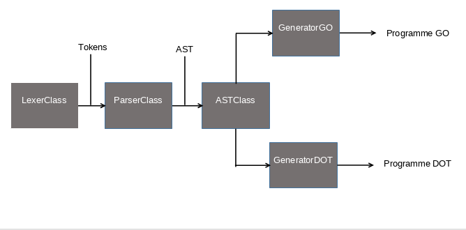
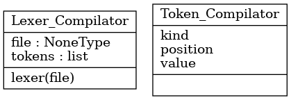
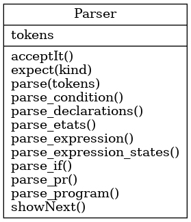
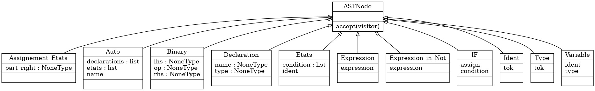
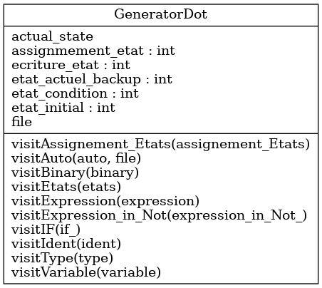
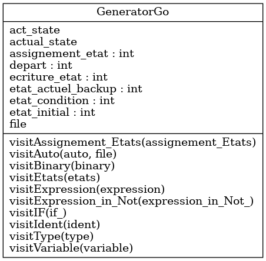
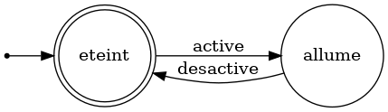
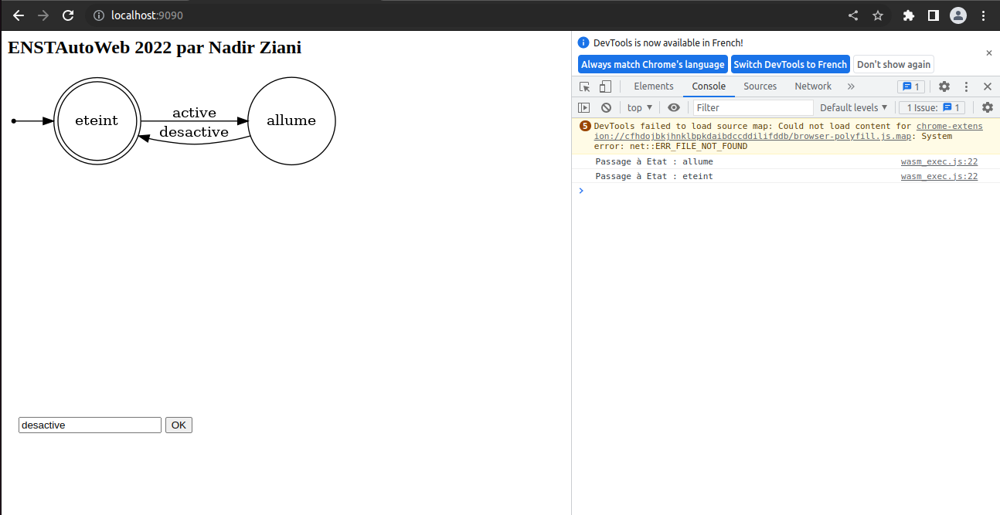

# Simulateur FSM(Finite State Machine)


## Qu'est une FSM ?
Une machine à état finis est une machine qui est susceptible d'être dans un nombre fini d'état mais étant un moment donné que dans un état à la fois. L'état dans lequel il se trouve se nomme l'état courant. Le passage d'un état à un autre est activé par un évenement ou une condition.

On rencontre de nombreuses FSM dans la vie quotidienne : un distributeur automatique, un ascenseur, un digicode etc...

Voici un exemple de machine à état finis : 


# Application : Simulateur de FSM

Dans le cadre du module Application Système, j'ai programmé un simulateur de machine à État Finis dans le but de montrer les possibilités du WebAssembly. En effet, avec l'accord de mon professeur Superviseur, j'ai décidé d'inventer un langage automate qui décrira une FSM. Ensuite, un compilateur que j'ai construit s'occupera de le compiler. Enfin à la sortie du compilateur, un diagramme automate sera crée ainsi qu'un programme en Go qui décrit la FSM. J'ai décidé de générer un langage de haut niveau et non le format textuelle du WebAssembly pour les mêmes raisons mentionnées dans la précedente partie.

Voici la chaîne de fonctionnement : 


## Le langage DSL_Auto : Syntaxe
J'ai décidé de rapprocher la grammaire et la syntaxe du langage aux des langages de haut niveau pour faciliter l'apprentissage et la prise en main du langage.

La syntaxe du langage DSL_Auto est la suivante : 
```
begin <nom_automate> :
    input = <entrées1>;<entrées2>
    state = <etat_initial>,<etat_1>,<etat_2>

    case <etat>:
        <condition>
    end case
end

```

le bloc condition est le suivant : 
```
if <input> then 
    next_state=etat_suivant
```

## Grammaire du langage

Auto -> "begin" identifier : {Declaration}   
Declaration -> Type "input" "=" identifier {"; identifier"} Type "state" "=" identifier {"," identifier}   
Type -> input | state  
Etats -> {Etats}  
Etats -> "case" identifier ":" {conditions} 
conditions -> if "identifier" then next_state=identifier   

Nous avons vu la syntaxe et la grammaire du langage DSL_Auto. Le langage DSL_Auto va être compilé et à partir de ce langage va être généré le diagramme automate ainsi que le programme Go décrivant la FSM.

## Fonctionnement du compilateur
Le compilateur DSL_Auto se décompose en trois partie : 
- Un lexer : cette partie va s’occuper de découper le code source en lexèmes.  
- Un parser : elle va vérifier que la suite de lexèmes obtenu grâce au lexer correspond à la grammaire de notre langage source. Cette partie va également concevoir l’arbre de syntaxe abstraite.
- Un visiteur : C’est notre design pattern. Il va principalement visiter l’arbre de syntaxe abstraite. Le visiteur est directement intégré dans le générateur de code.

Ci-dessous, un diagramme décrivant l'architecture du compilateur : 

    


Tout d'abord, il y a l'analyse lexical :    
En effet, une expression régulière est une chaine de caractère qui décrit, selon une syntaxe précise, un ensemble de chaîne de caractère possible.
L’analyse lexical sert à découper le code source en mots ou lexème et ensuite vérifier avec les expressions régulières que ces mots correspondent au dictionnaire du langage source.    
Voici ci-dessous le dictionnaire de mots avec leurs expressions régulière correspondantes :

```Python
reg_expression = [
    (r'[ \n\t]+', None),
    (r'#[^\n]*', None),
    (r'case\b', 'CASE'),
    (r'if\b', 'IF'),
    (r'begin\b', 'BEGIN'),
    (r'state\b', 'STATE'),
    (r'not\b', 'NOT'),
    (r'next_state\b', 'NEXTST'),
    (r'input\b', 'INPUT'),
    (r'state\b', 'STATE'),
    (r'then\b', 'THEN'),
    (r'end\b', 'END'),
    (r'\(', 'LPAREN'),
    (r'\)', 'RPAREN'),
    (r'\{', 'LBRACE'),
    (r'\}', 'RBRACE'),
    (r'\,', 'COMMA'),
    (r'\:', 'COLON'),
    (r'\;', 'SEMICOLON'),
    (r'\=', 'ASSIGN'),
    (r'and', 'AND'),
    (r'or', 'OR'),
    (r'[a-zA-Z][a-zA-Z0-9]*', 'IDENTIFIER')
    
]
```
Ci-dessus, nous définissons une expression régulière pour chaque mot clé du langage de programmation.

Ensuite le lexer va séparer le langage source en lexèmes et voir si chaque lexème correspond à une des expressions régulières définit ci-dessus. C’est qu’on appelle l’analyse lexicale.

Voici le diagramme UML du lexer :    



Ensuite viens l'étape de l'analyse syntaxique : 

L’analyse syntaxique dans un compilateur est une étape où le compilateur va vérifier que l’enchaînement des lexèmes correspond bien à la grammaire du langage. Ce sera le rôle de notre analyseur syntaxique ou parser.

Voici le diagramme UML de l'analyseur syntaxique : 


L’analyseur syntaxique va viser deux objectifs dans notre compilateur :   

- Vérifier que le code source respecte la grammaire préétablie du langage.     

- Construire un arbre de syntaxe abstraite.   
  
Ici, nous utilisons dans notre analyseur syntaxique une analyse récursive descendante et nous utilisons généralement trois méthodes dans notre analyseur syntaxique et ces méthodes sont implémenté dans les méthodes parse_X également :    

- La méthode expect() : elle va servir à consommer un lexème de type attendu.
- La méthode acceptit() : elle va consommer le lexème courant.
- La méthode showNext() : elle va retourner le lexème courant.   

La méthode parse définit dans le diagramme de classe sont des méthodes où on définit la grammaire du langage soit ses règles.
Ainsi pour chaque déclaration de variable, pour chaque boucle conditionnel et conditions, le parser va vérifier via les méthodes parse_X() que chaque enchaînements de lexèmes du code source respectent bien la grammaire du langage.

Prenons un exemple sur le compilateur : 

```Python
def parse_declarations(self):
        declara = []
        while self.showNext().kind in ["INPUT", "STATE"]:
            ty = astClass.Type(self.showNext().value)
            self.acceptIt()
            self.expect("ASSIGN")
            val = self.showNext().value
            self.expect("IDENTIFIER")
            ident_id = astClass.Ident(val)
            declara.append(astClass.Variable(ident_id, ty))
            while self.showNext().kind == "SEMICOLON":
                self.acceptIt()
                value = self.showNext().value
                ident_id = astClass.Ident(value)
                self.expect("IDENTIFIER")
                declara.append(astClass.Variable(ident_id, ty))
            while self.showNext().kind == "COMMA":
                self.acceptIt()
                value = self.showNext().value
                ident_id = astClass.Ident(value)
                self.expect("IDENTIFIER")
                declara.append(astClass.Variable(ident_id, ty))
        return declara
```

Ici la fonction va consommer un lexème courant : ce sera soit input soit state. Par la suite, la fonction s'attend à consommer un léxème de type ASSIGN soit un "=". Ensuite, la fonction s'attend à consommer un lexeme de type IDENTIFIER soit le nom de l'état ou de l'entrée. Si la fonction consomme un lexeme qui n'est pas ce qui est attendu, cela retournera une erreur avec la fonction expect(). Puis, deux choix de syntaxe s'offre à l'utilisateur, soit un ";" entre les identifiers, soit une ",". Et le même processus se repetera.

Comme vous pouvez le voir dans la fonction, la fonction rempli l’arbre à chaque lexème consommé.
Le principe s’applique aux autre fonctions parse_X().

Voici le diagramme UML de l'AST :    


## Générateur de Code Dot et GO

Dans les génerateurs de code, le principe de visite de l'AST est intégré. Donc un visiteur est implémenté.

La visite va fonctionner de la manière suivante :   
- Une méthode accept() sera introduit dans chaque classe de notre AST.
-  Le visiteur possède autant de méthode visitK () que de classe K dans notre AST
-  Chaque méthode visitK() se présente comme une succession d'appels xi.accept(self) dont xi attribut de chaque classe K.

Voici le diagramme UML de Générateur Dot et GO :   


Générateur GO :    


## Démonstration de fonctionnement : 

Soit une FSM qui décrit le fonctionnement d'une lampe. La lampe à deux états : eteint ou allumé. Le passage d'un état à l'autre se fera par la commande active(pour allumer la lampe) et désactive(pour éteindre la lampe). 

Voici le programme codé en DSLAuto : 
```
begin lampe : 
    input = active;desactive
    
    state = eteint,allume

    case eteint:
        begin:
            if (active) then
                     next_state=allume
                        
    end case

    case allume:
    	begin:
        	if (desactive) then
                     next_state=eteint 
            	
    end case

end
```
Le Diagramme Dot est généré à partir de code DOT généré par le compilateur :
```Graphviz
digraph lampe{
rankdir=LR;
size="8,5"
node [shape = doublecircle];eteint;
node [shape = point ]; qi
node [shape = circle];
qi -> eteint;
node [shape = circle];allume;
eteint -> allume [ label = "active"];
allume -> eteint [ label = "desactive"];
}
```    
Ensuite l'image dot est généré en faisant cette commande : 
```bash
dot -Tpng code.gv -o ../assets/code2.png
```



Ainsi que le code GO correspondant : 
```GO
package main

import (

	"fmt"

	"syscall/js"

)

type State uint32

var commande string

var document js.Value

func getElementById(elem string) js.Value {

	document = js.Global().Get("document")
	return document.Call("getElementById", elem)
}
func getElementValue(elem string, value string) js.Value {

	return getElementById(elem).Get(value)
}

func GetString(elem string, value string) string {

	return getElementValue(elem, value).String()
}

func main() {
	quit := make(chan struct{}, 0)
	const (
	eteint State = iota

	allume
)
	state := eteint

	button := js.Global().Get("document").Call("getElementById", "ok")
	image := js.Global().Get("document").Call("getElementById", "image")
	image.Set("src", "code2.png")
	var cb js.Func
	cb = js.FuncOf(func(this js.Value, args []js.Value) interface{} {
	commande = GetString("in", "value")

		if state == eteint {

			if commande == "active" {
				fmt.Println(" Passage à Etat : allume")
				state = allume
				}
		}
		if state == allume {

			if commande == "desactive" {
				fmt.Println(" Passage à Etat : eteint")
				state = eteint
				}
		}
			return nil

		})
	button.Call("addEventListener", "click", cb)
	<-quit
}
```
ATTENTION : il se peut que le générateur GO mette la ligne state := eteint dans la partie const. La solution est de modifier le code GO à la main et mettre la ligne correspondante après le bloc const.

Ensuite, après avoir compléte cette étape, il faut aller dans le dossier assets. Dans ce dossier, il y a un makefile qui permettra de compiler le code GO généré et ainsi le tester :    
Aller dans le dossier assets :     
```bash
cd ../assets
```

Puis faire : 
```bash
make fsm
```

Enfin lancer le serveur en faisant : 
```bash
cd ../
cd cmd/server
go run main.go
```

Let's Test ! 

Aller à l'adresse https://localhost:9090 puis testez !



## Piste pour générer l'animation

Par manque de temps, je n'ai pas pu mettre en oeuvre la génération d'animation du diagramme automate. Cependant, j'ai des pistes pour mettre en oeuvre une animation qui indique l'état courant de l'automate.

On peut générer à partir du générateur une animation Canvas qui indique l'état courant de l'automate. 
En effet, L'élément canvas est un composant du langage Web HTML qui permet d'effectuer des rendus dynamiques d'images bitmap en utilisant des scripts dans des langages tels que le javascript. 

Canvas est également supporté par le langage Go. On peut donc générer une animation canvas qui indique l'état courant de l'automate à partir du compilateur.

Nous pouvons donc créer un élément HTML(un canvas) à partir du langage Go en communiquant avec le DOM(Document Object Model) et générer le tout à partir du compilateur.