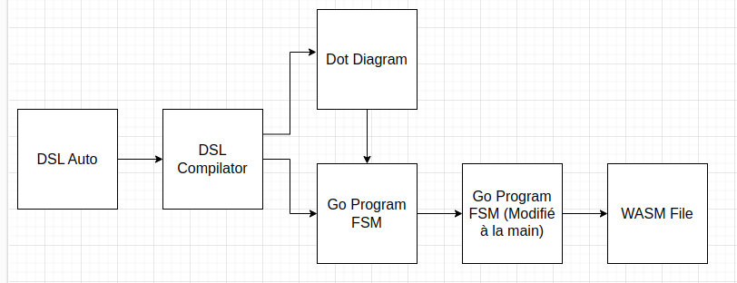

# Simulateur FSM(Finite State Machine)

## Qu'est une FSM ?
Une machine à état finis est une machine qui est susceptible d'être dans un nombre fini d'état mais étant un moment donné que dans un état à la fois. L'état dans lequel il se trouve se nomme l'état courant. Le passage d'un état à un autre est activé par un évenement ou une condition.

On rencontre de nombreuses FSM dans la vie quotidienne : un distributeur automatique, un ascenseur, un digicode etc...

Voici un exemple de machine à état finis : 

# Application : Simulateur de FSM

Dans le cadre du module Application Système, j'ai programmé un simulateur de machine à État Finis dans le but de montrer les possibilités du WebAssembly. En effet, avec l'accord de mon professeur Superviseur, j'ai décidé d'inventer un langage automate qui décrira une FSM. Ensuite, un compilateur que j'ai construit s'occupera de le compiler. Enfin à la sortie du compilateur, un diagramme automate sera crée ainsi qu'un programme en GO qui décrit la FSM.

Voici la chaîne de fonctionnement : 

